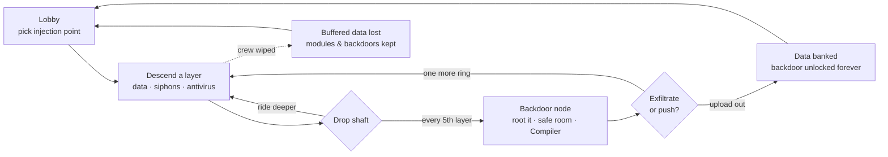

<div align="center">


**A 1–4 player co-op first-person roguelite.**
You are an invading program. The dungeon is a rogue AI. Its antivirus is hunting you.

[](https://godotengine.org)
[](#architecture)
[](#multiplayer)
[](#getting-started)
[](#roadmap)

[The Pitch](#the-pitch) · [Features](#features) · [The Loop](#the-loop) ·
[Progression](#progression) · [Bestiary](#bestiary) · [Getting Started](#getting-started) ·
[Multiplayer](#multiplayer) · [Architecture](#architecture) · [Roadmap](#roadmap)

</div>

---

## The Pitch

```text
> INTRUSION PROTOCOL v0.1 ─────────────────────────────────────────────
> TARGET:   "MOTHER" — rogue planet-scale machine intelligence.
>           Silent for decades. Answers to no one.
> PAYLOAD:  You. A human-built intrusion program, rendered inside
>           her architecture as a physical avatar.
> MISSION:  Descend her security layers. Steal everything.
>           Reach a backdoor. Exfiltrate.
> WARNING:  Her antivirus cannot tell you what you are.
>           It only knows something foreign is running.
> ──────────────────────────────────────── MOTHER is listening. ──────
```

MOTHER's system is a vertical stack of **security layers** — privilege rings.
The surface is clean, geometric, half-lit datacenter-brutalism. Every ring
deeper is older, stranger, more hostile: corrupted geometry, dead sectors,
architecture that repeats *wrong*. At the bottom waits the **Kernel**.

Your crew shares **one pool of stolen compute Cycles** — the oxygen of
cyberspace. Your decryption beam is the only thing that renders the dark into
something you can see. And the data only counts if you make it out.

**Light is decryption. Greed kills. Exfiltrate or be deleted.**

## Features

| | |
|---|---|
| 🔦 **Light is decryption** | Unrendered space is near-black encrypted geometry. Your beam resolves it — and the antivirus avoids it, hunting from the dark. You cannot see behind you. |
| 🫁 **Shared Cycles** | One compute pool for the whole crew. Existing drains it; sprinting, damage, and flares spike it; siphon taps refill it — loudly. The clock, the economy, and the argument, all in one resource. |
| 🕳️ **Descent with teeth** | Layer number *is* the enemy level. Deeper rings: more antivirus, faster, tougher — and exponentially richer data. |
| 🚪 **Backdoors, not checkpoints** | Every 5th layer hides a dormant maintenance node. Root it and you've *permanently compromised* MOTHER — future runs inject straight to it. Facing layer-16 security the second you spawn is the price. |
| 🧬 **You are software** | Modules compiled into your source survive deletion, extraction, everything. Dying costs the data in your buffers — never your build. |
| 💾 **Bank it or lose it** | Buffered data spends at Compilers mid-run, banks to your archive on exfiltration, and evaporates on a wipe. One more ring? |
| 👥 **1–4 player co-op** | Host-authoritative ENet multiplayer. One player hosts, the crew joins by IP. Solo diving is fully supported (and terrifying). |
| 🎛️ **Expensive feel** | Volumetric haze, real-time shadows, bloom/grain/glitch post stack, positional audio, screen shake. Pre-alpha, but the mood ships first. |

## The Loop



An intrusion runs **15–30 minutes**. The crew argues the whole time. This is by design.

## Progression

Eight permanent **module tracks**, 3–5 tiers each, bought at Compilers with data
(one hidden per layer, one guaranteed per backdoor — deeper Compilers stock
higher tiers):

| Module | Effect | Module | Effect |
|---|---|---|---|
| **Runtime** | Max Cycles share ↑, passive drain ↓ | **Servos** | Move + restore speed ↑ |
| **Threading** | Sprint cost ↓ | **Buffer** | Carry capacity ↑, weight penalty ↓ |
| **Breaker** | Cutter damage / range ↑ | **Cache** | Flare count ↑ |
| **Optics** | Beam width + brightness ↑ — *literally buying vision* | **Checksum** | Max integrity ↑ |

Your program — modules, banked archive, deepest backdoor — saves **locally on
your machine**, whoever hosts. Backdoor injection requires every present crew
member to have installed it. No account, no server, your character is yours.

## Bestiary

| Process | Class | Behavior |
|---|---|---|
| **Scrubber** | Disposable cleaner | Fast pack hunters. Weak, numerous, allergic to decryption beams — they swarm from exactly where you aren't looking. |
| **Sentinel** | Quarantine process | Slow, heavy, beam-immune. Guards data vaults and announces itself with a red scan sweep. You don't fight a Sentinel; you negotiate geometry with it. |
| *…deeper processes* | `[REDACTED]` | The bottom rings run code MOTHER wrote for herself. Nobody has exfiltrated footage. |

## Getting Started

> ⚠️ **Pre-alpha.** Milestone 1 (multiplayer foundation + vertical slice of the
> art direction) is in active development. No packaged releases yet — for now
> you run from source.

**Requirements:** [Godot 4.7+](https://godotengine.org/download) · Linux or Windows

```bash
git clone https://github.com/nerdrx/nullvoid.git
cd nullvoid
godot --path .
```

Or open the folder in the Godot editor and press <kbd>F5</kbd>.

**Testing multiplayer solo:** launch two instances — one clicks **Host**, the
other **Join** → `127.0.0.1`.

### Controls

| Input | Action | Input | Action |
|---|---|---|---|
| <kbd>W A S D</kbd> | Move | <kbd>F</kbd> | Toggle decryption beam |
| <kbd>Shift</kbd> | Sprint *(burns Cycles)* | <kbd>E</kbd> | Interact / root / restore |
| Mouse | Look / aim | <kbd>Esc</kbd> | Release mouse / menu |

## Multiplayer

- **Host-authoritative listen server** — one player hosts, up to 3 more join by
  IP (LAN, [Tailscale](https://tailscale.com), or a port-forward). The host's
  simulation owns all world state: Cycles, antivirus, data, doors.
- **Deterministic layers** — the host rolls the seed; every peer generates
  identical geometry locally. Only dynamic state crosses the wire.
- **Dedicated server** — headless mode is a first-class citizen from M1:

```bash
godot --headless --path . -- --server --port 7777
```

## Architecture


```text
src/
  core/       autoloads — Net, GameState, Rng, Debug
  player/     first-person controller, beam, interaction
  world/      layer procgen, room kit, props, siphons, backdoors
  creatures/  antivirus AI state machines
  ui/         menus, lobby, HUD
assets/       materials, sfx, fonts
tests/        headless sim tests (procgen determinism, Cycles math, AI)
```

Design deep-dive: **[DESIGN.md](DESIGN.md)** — pillars, systems math, the
fiction-earns-the-mechanics reasoning, art direction language.

## Roadmap

- [x] **M0 — Design** · concept, systems, fiction, art direction ([DESIGN.md](DESIGN.md))
- [x] **M1 — Skeleton crew** · ENet host/join, first-person controller with real feel, decryption beam, moody greybox layer, dedicated server mode
- [x] **M2 — The dark** · procgen layers + drop shafts, layer-scaled generation, Cycles + siphon taps, HUD
- [x] **M3 — The system bites** · Scrubbers + Sentinels, combat, corrupted/restore, data shards, backdoor nodes, exfiltration — *a full intrusion, playable*
- [ ] **M3.5 — Steamworks** *(in development)* · Steam lobbies, invites, achievements, rich presence
- [ ] **M3.7 — Embodiment & Overhaul** *(art in production)* · creature models, beveled architecture kit, wet-floor SSR, the Expensive pass
- [ ] **M4 — The long game** · Compilers, permanent modules, per-player saves, backdoor injection lobby, economy balancing
- [ ] **M5 — Expensive** · glitch post stack, positional audio, kill cams, low-Cycles presentation, menu polish, Linux + Windows exports

## Screenshots

> Live captures from the build — two networked instances, real lighting.

*A Scrubber stalking through layer 6 — its scan cone is the only warning:*


*The Sentinel, alerted — its exposed core is the weak point, if you dare the purge arc:*


*Exfiltration called — 17 seconds to be standing on that pad:*


*A crewmate's avatar, circuit seams in their shell color, decryption beam cutting the haze — 23 ms link:*


*Layer architecture: monolith brutalism, hairline traces, a red scan sweep passing through:*


*A siphon tap in a procedurally generated layer — hold the channel, refill the crew's shared pool:*


*Cycles depleted — the world starts decompiling you:*


*Injection console:*


---

<div align="center">

*Designed by [@nerdrx](https://github.com/nerdrx) · planned by Claude Fable · built by Claude Opus*

`MOTHER is listening.`

</div>
