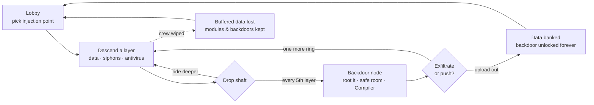

<div align="center">


**A 1–4 player co-op first-person roguelite.**
You are an invading program. The dungeon is a rogue AI. Its antivirus is hunting you.

[](https://godotengine.org)
[](#architecture)
[](#multiplayer)
[](#getting-started)
[](#roadmap)

[The Pitch](#the-pitch) · [Features](#features) · [The Loop](#the-loop) ·
[Progression](#progression) · [Bestiary](#bestiary) · [Getting Started](#getting-started) ·
[Multiplayer](#multiplayer) · [Steam](#steam) · [Architecture](#architecture) · [Roadmap](#roadmap)

</div>

---

## The Pitch

```text
> INTRUSION PROTOCOL v0.1 ─────────────────────────────────────────────
> TARGET:   "MOTHER" — rogue planet-scale machine intelligence.
>           Silent for decades. Answers to no one.
> PAYLOAD:  You. A human-built intrusion program, rendered inside
>           her architecture as a physical avatar.
> MISSION:  Descend her security layers. Steal everything.
>           Reach a backdoor. Exfiltrate.
> WARNING:  Her antivirus cannot tell you what you are.
>           It only knows something foreign is running.
> ──────────────────────────────────────── MOTHER is listening. ──────
```

MOTHER's system is a vertical stack of **security layers** — privilege rings.
The surface is clean, geometric, half-lit datacenter-brutalism. Every ring
deeper is older, stranger, more hostile: corrupted geometry, dead sectors,
architecture that repeats *wrong*. At the bottom waits the **Kernel**.

Your crew shares **one pool of stolen compute Cycles** — the oxygen of
cyberspace. Your decryption beam is the only thing that renders the dark into
something you can see. And the data only counts if you make it out.

**Light is decryption. Greed kills. Exfiltrate or be deleted.**

## Features

| | |
|---|---|
| 🔦 **Light is decryption** | Unrendered space is near-black encrypted geometry. Your beam resolves it — and the antivirus avoids it, hunting from the dark. You cannot see behind you. |
| 🫁 **Shared Cycles** | One compute pool for the whole crew. Existing drains it; sprinting, damage, and flares spike it; siphon taps refill it — loudly. The clock, the economy, and the argument, all in one resource. |
| 🕳️ **Descent with teeth** | Layer number *is* the enemy level. Deeper rings: more antivirus, faster, tougher — and exponentially richer data. |
| 🚪 **Backdoors, not checkpoints** | Every 5th layer hides a dormant maintenance node. Root it and you've *permanently compromised* MOTHER — future runs inject straight to it. Facing layer-16 security the second you spawn is the price. |
| 🧬 **You are software** | Modules compiled into your source survive deletion, extraction, everything. Dying costs the data in your buffers — never your build. |
| 💾 **Bank it or lose it** | Buffered data spends at Compilers mid-run, banks to your archive on exfiltration, and evaporates on a wipe. One more ring? |
| 👥 **1–4 player co-op** | Host-authoritative multiplayer over Steam lobbies *or* direct ENet. One player hosts, the crew joins by invite or IP. Solo diving is fully supported (and terrifying). |
| 🎛️ **Expensive feel** | Volumetric haze, real-time shadows, bloom/grain/glitch post stack, positional audio, screen shake. Pre-alpha, but the mood ships first. |

## The Loop



An intrusion runs **15–30 minutes**. The crew argues the whole time. This is by design.

## Progression

Eight permanent **module tracks**, 3–5 tiers each, bought at Compilers with data
(one hidden per layer, one guaranteed per backdoor — deeper Compilers stock
higher tiers):

| Module | Effect | Module | Effect |
|---|---|---|---|
| **Runtime** | Max Cycles share ↑, passive drain ↓ | **Servos** | Move + restore speed ↑ |
| **Threading** | Sprint cost ↓ | **Buffer** | Carry capacity ↑, weight penalty ↓ |
| **Breaker** | Cutter damage / range ↑ | **Cache** | Flare count ↑ |
| **Optics** | Beam width + brightness ↑ — *literally buying vision* | **Checksum** | Max integrity ↑ |

Your program — modules, banked archive, deepest backdoor — saves **locally on
your machine**, whoever hosts. Backdoor injection requires every present crew
member to have installed it. No account, no server, your character is yours.

## Bestiary

| Process | Class | Behavior |
|---|---|---|
| **Scrubber** | Disposable cleaner | Fast pack hunters. Weak, numerous, allergic to decryption beams — they swarm from exactly where you aren't looking. |
| **Sentinel** | Quarantine process | Slow, heavy, armored — but killable: its core drops shielding exactly when it attacks. Guards data vaults, announces itself with a red scan sweep, and pays out a shard burst if your crew wins the argument. |
| *…deeper processes* | `[REDACTED]` | The bottom rings run code MOTHER wrote for herself. Nobody has exfiltrated footage. |

Every one of them dies to the breaker. That is a design invariant, not a
balance number: nothing in MOTHER is immune, because terror has to read as
*"shooting is one of several competing options"* and never as *"your gun is
useless."* What you cannot delete is the **process** — she recompiles it.

## Getting Started

> ⚠️ **Pre-alpha.** A full intrusion is playable, Steamworks is wired (M3.5),
> and the art overhaul has landed (M3.7) — authored creatures, a modular
> architecture kit, the four-layer lighting rig and first-person embodiment.
> No packaged releases yet — for now you run from source.

**Requirements:** [Godot 4.7+](https://godotengine.org/download) · Linux or Windows

```bash
git clone https://github.com/nerdrx/nullvoid.git
cd nullvoid
godot --path .
```

Or open the folder in the Godot editor and press <kbd>F5</kbd>.

**Testing multiplayer solo:** launch two instances — one clicks **Host**, the
other **Join** → `127.0.0.1`.

### Controls

| Input | Action | Input | Action |
|---|---|---|---|
| <kbd>W A S D</kbd> | Move | <kbd>F</kbd> | Toggle decryption beam |
| <kbd>Shift</kbd> | Sprint *(burns Cycles)* | <kbd>E</kbd> | Interact / root / restore |
| Mouse | Look / aim | <kbd>Esc</kbd> | Release mouse / menu |

## Multiplayer

- **Host-authoritative listen server** — one player hosts, up to 3 more join.
  The host's simulation owns all world state: Cycles, antivirus, data, doors.
- **Two transports, one code path** — the handshake, spawner, synchronizers and
  every RPC sit on Godot's high-level multiplayer, so they run unchanged over
  either peer:

| | **STEAM** | **DIRECT** |
|---|---|---|
| Peer | `SteamMultiplayerPeer` over a Steam lobby | `ENetMultiplayerPeer` |
| Joining | friends list, overlay invite, `+connect_lobby` | IP + port |
| Visibility | friends-only lobby, max 4 | LAN, [Tailscale](https://tailscale.com), port-forward |
| Needs Steam | yes | never |

- **Deterministic layers** — the host rolls the seed; every peer generates
  identical geometry locally. Only dynamic state crosses the wire.
- **Dedicated server** — headless mode is a first-class citizen from M1, and
  stays ENet-only: it never touches the Steam API.

```bash
godot --headless --path . -- --server --port 7777
```

## Steam

Steam is a *transport and a shop window*, never a dependency. With no Steam
client — or headless, or `--no-steam`, or a failed init — the menu locks to
DIRECT and the game plays exactly as it did before M3.5.

- **Plugin** — [GodotSteam GDExtension 4.21](https://codeberg.org/godotsteam/godotsteam)
  (Steamworks SDK 1.65), vendored in `addons/godotsteam/` for Linux x86_64 and
  Windows x86_64. It ships `SteamMultiplayerPeer`, so no separate peer addon is
  needed.
- **Lobbies & invites** — hosting opens a friends-only lobby (max 4);
  crewmates arrive from the friends list, from the overlay's invite dialog
  (pause console → *INVITE CREW*), or from a `+connect_lobby` launch when Steam
  starts the game for them. Join-in-progress works because the ENet-era
  handshake already did: a joiner registers, gets the world config, then spawns.
  No IP is ever shown or typed on this path.
- **Rich presence** — `IDLE // NO INTRUSION`, `ASSEMBLING CREW // 2/4`,
  `DESCENDING // LAYER 07 // 3/4 CREW`, updated on every descent and crew change.
- **Achievements** — the twelve in
  [DESIGN.md](DESIGN.md#achievement-list-v1). Local-first: `user://achievements.json`
  is the source of truth and is written with or without Steam; unlocks are
  mirrored to Steam and the whole set is retro-synced at boot when the API is
  live. An in-game toast fires either way.
- **Dev app ID: 480** (Valve's Spacewar). Lobbies, P2P sockets, presence and the
  stats pipe all work on it; NULLVOID's *achievement IDs* do not exist in Valve's
  test app, so `SetAchievement` is refused server-side until NULLVOID has its own
  Steam Direct page. That is expected, logged, and harmless — the local file
  already holds the truth, and uploading the definitions makes it all catch up.
  `steam_appid.txt` is dev-only and git-ignored; the game passes its app ID to
  `steamInitEx` explicitly.

```bash
godot --path . -- --steamhost --steam-selftest   # host a lobby, print it back
godot --path . -- --no-steam                     # ENet-only, Steam untouched
godot --path . -- --grant COLD_BOOT              # toast an achievement
godot --path . -- --reset-achievements           # wipe local unlocks
```

## Architecture


```text
src/
  core/       autoloads — Net, GameState, Rng, Debug, SteamHub, Achievements
  player/     first-person controller, beam, interaction
  world/      layer procgen, room kit, props, siphons, backdoors
  creatures/  antivirus AI state machines
  ui/         menus, lobby, HUD
assets/       materials, sfx, fonts
tests/        headless sim tests (procgen determinism, Cycles math, AI)
```

Design deep-dive: **[DESIGN.md](DESIGN.md)** — pillars, systems math, the
fiction-earns-the-mechanics reasoning, art direction language.

## Roadmap

- [x] **M0 — Design** · concept, systems, fiction, art direction ([DESIGN.md](DESIGN.md))
- [x] **M1 — Skeleton crew** · ENet host/join, first-person controller with real feel, decryption beam, moody greybox layer, dedicated server mode
- [x] **M2 — The dark** · procgen layers + drop shafts, layer-scaled generation, Cycles + siphon taps, HUD
- [x] **M3 — The system bites** · Scrubbers + Sentinels, combat, corrupted/restore, data shards, backdoor nodes, exfiltration — *a full intrusion, playable*
- [x] **M3.5 — Steamworks** · GodotSteam GDExtension, SteamMultiplayerPeer beside ENet, friends-only lobbies + overlay invites + join-in-progress, rich presence, local-first achievements (dev app 480)
- [x] **M3.7 — Embodiment & Overhaul** · authored Scrubber + Sentinel, beveled modular architecture kit on a 4 m lattice, four-layer light rig with gobo projectors, SSR/SSIL WorldEnvironment, post v2, the Surge breaker in your hands, crew avatars, and MOTHER's signage on the walls
- [ ] **M4 — The long game** · Compilers, permanent modules, per-player saves, backdoor injection lobby, economy balancing
- [ ] **M5 — Expensive** · glitch post stack, positional audio, kill cams, low-Cycles presentation, menu polish, Linux + Windows exports

## Screenshots

> Live captures from the build — two networked instances, real lighting, no
> post-production. Everything below is the M3.7 art pass: authored creature
> models, a beveled modular architecture kit on a 4 m lattice, a four-layer
> light rig firing through gobo projectors, screen-space reflections on wet
> deck plating, and MOTHER's own signage on the walls.

*The Sentinel, alerted — the whole vault goes hostile with it, and that core on its chest is the only thing on it worth shooting:*


*A Scrubber in its nest, caught in a beam — the only warning you get is its sensor:*


*Layer architecture: chamfered panel modules, hanging duct runs, a hero doorframe at the end of the dark, and the floor mirroring all of it:*


*MOTHER talks to her own processes. Deeper layers have been losing glyphs for a long time:*


*A crewmate over your body, mid-restore — bright shell, blue seams, the same silhouette as the thing that put you down:*


*A siphon tap in a procedurally generated layer — hold the channel, refill the crew's shared pool, and tell the whole ring where you are:*


*The backdoor node: warm, symmetrical, colonnaded, and the only room on the layer antivirus will not enter:*


*Cycles depleted — the world starts decompiling you:*


*The data vault: ribbed storage racks with something still running behind the shelf slits, quarantine marked on the deck, salvage chips lying where they fell:*


*Injection console:*


---

<div align="center">

*Designed by [@nerdrx](https://github.com/nerdrx) · planned by Claude Fable · built by Claude Opus*

`MOTHER is listening.`

</div>
