<div align="center">

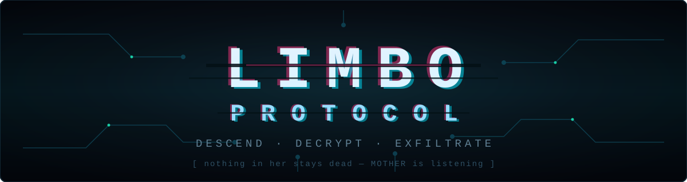

**A 1–4 player co-op first-person roguelite.**
You are an invading program. The dungeon is a rogue AI. Its antivirus is hunting you.
*Nothing in her stays dead — least of all you.*

**[▶ Watch the teaser](.github/assets/teaser.mp4)** · 77s, sound on — the hunt

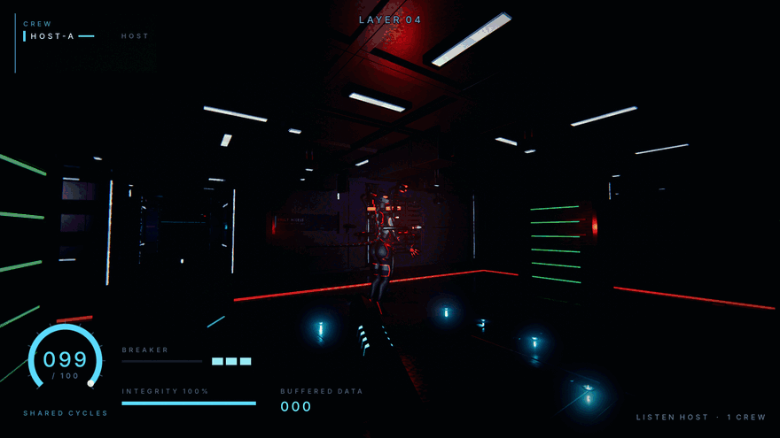

[](https://godotengine.org)
[](#architecture)
[](#multiplayer)
[](#getting-started)
[](#roadmap)
[](#features)

[The Pitch](#the-pitch) · [Features](#features) · [The Loop](#the-loop) ·
[Progression](#progression) · [Bestiary](#bestiary) · [Getting Started](#getting-started) ·
[Multiplayer](#multiplayer) · [Steam](#steam) · [Architecture](#architecture) · [Roadmap](#roadmap)

</div>

---

## The Pitch

```text
> INTRUSION PROTOCOL v0.1 ─────────────────────────────────────────────
> TARGET:   "MOTHER" — rogue planet-scale machine intelligence.
>           Silent for decades. Answers to no one.
> PAYLOAD:  You. A human-built intrusion program, rendered inside
>           her architecture as a physical avatar.
> MISSION:  Descend her security layers. Steal everything.
>           Reach a backdoor. Exfiltrate.
> WARNING:  Her antivirus cannot tell you what you are.
>           It only knows something foreign is running.
> ──────────────────────────────────────── MOTHER is listening. ──────
```

MOTHER's system is a vertical stack of **security layers** — privilege rings.
The surface is clean, geometric, half-lit datacenter-brutalism. Every ring
deeper is older, stranger, more hostile: corrupted geometry, dead sectors,
architecture that repeats *wrong*. At the bottom waits the **Kernel**.

Your crew shares **one pool of stolen compute Cycles** — the oxygen of
cyberspace. Your beam is the only light you have, and the dark is nearly
total. And the data only counts if you make it out.

**Greed kills. Exfiltrate or be deleted.**

## Features

| | |
|---|---|
| 🔦 **Your beam is the only light** | The dark is near-total, and your beam is the one thing that cuts it. The antivirus avoids the light and hunts from the black — and you cannot see behind you. |
| 🫁 **Shared Cycles** | One compute pool for the whole crew. Existing drains it; sprinting, damage, and flares spike it; siphon taps refill it — loudly. The clock, the economy, and the argument, all in one resource. |
| 🕳️ **Descent with teeth** | Layer number *is* the enemy level. Deeper rings: more antivirus, faster, tougher — and exponentially richer data. |
| 🚪 **Backdoors, not checkpoints** | Every 5th layer hides a dormant maintenance node. Root it and you've *permanently compromised* MOTHER — future runs inject straight to it. Facing layer-16 security the second you spawn is the price. |
| 🧬 **You are software** | Modules compiled into your source survive deletion, extraction, everything. Dying costs the data in your buffers — never your build. |
| 💾 **Bank it or lose it** | Buffered data spends at Compilers mid-run, banks to your archive on exfiltration, and evaporates on a wipe. One more ring? |
| 🔧 **The world fights back** | Rewire junctions with one bus and three loads (lights *or* door locks *or* vent fans — never two). Vents you weld shut with the breaker to stop a nest refilling. Cabinets you cut open loudly or unlock silently. Bulkheads you seal to break a pursuit, until MOTHER forces them. Kick a can in the dark and something turns around. |
| ⌨️ **Terminals you actually type at** | GTFO-style CRT consoles wired into MOTHER's own indices. `LIST DATA`. `LOCATE COMPILER`. `QUERY VAULT-7C`. Every query is loud, takes a couple of seconds to process, and comes back with more of its glyphs missing the deeper you are. |
| 👥 **1–4 player co-op** | Host-authoritative multiplayer over Steam lobbies *or* direct ENet. One player hosts, the crew joins by invite or IP. Solo diving is fully supported (and terrifying) — **no mechanic in this game ever needs a second pair of hands**. |
| 🎛️ **Expensive feel** | Volumetric haze, real-time shadows, bloom/grain/glitch post stack, positional audio, screen shake. Pre-alpha, but the mood ships first. |
| 🔊 **A soundscape with an author** | A fully synthesized palette — no samples, no licensing. The mix encodes the glitch-authorship law: warm, worn analog is *you* (tape, transformer hum, solenoids); cold detuned digital is *MOTHER* (bitcrush, sub mass, granular data-noise). Two klaxons, two authors — you can tell whose alarm is going off in the dark. An adaptive score stacks tension → threat → terror over a depth-band floor as the hunt closes in. |
| 🧏 **Accessibility is a ship gate** | Not a setting bolted on later. **Directional sound captions** give deaf and hard-of-hearing players the game's primary threat telegraph back — *what*, *where* (8-way bearing), and *how close* — because a positional-audio horror game is otherwise unplayable without ears. On top of the always-on photosensitivity flash caps: audio-comfort controls (per-family volumes, a toggle to kill the 15.7 kHz CRT whine, a soft-limiter for sudden loud events) reachable mid-run from the pause menu. |

## The Laws

Four rules govern every design decision in this game. They are invariants, not guidelines:

| | |
|---|---|
| ⚖️ **Killability** | Every monster dies to the breaker. You delete *instances*, never *processes* — persistence comes from respawn and behavior, not immunity. Your gun is never useless. |
| 🧍 **The solo invariant** | Everything is fully doable alone. Co-op multiplies tension — it never gates content. Solo is the scariest mode, not a degraded one. |
| 🌑 **Darkness** | Expensive never means lit. Structure is revealed by your beam, not by the room. |
| 📺 **Glitch authorship** | Analog failure (tracking tears, sync loss) is *your* aging hardware. Pristine digital glitch is *MOTHER* acting on you. The failure mode tells you who is speaking. |

## The Loop

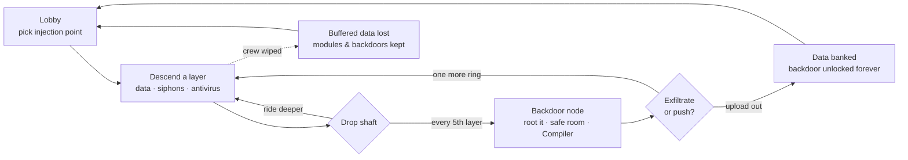

An intrusion runs **15–30 minutes**. The crew argues the whole time. This is by design.

## Progression

Eight permanent **module tracks**, bought at **Compilers** — one hidden
somewhere on every layer, one guaranteed in every backdoor sanctuary. Deeper
Compilers stock higher tiers, and a sanctuary terminal stocks one tier deeper
than the ring it stands on:

| Module | Tiers | Effect at tier 1 → max | Tier 1 |
|---|---|---|---|
| **Runtime** | 5 | Cycles share 100 → 180, drain 0.60 → 0.42/s | 300 |
| **Threading** | 3 | Sprint cost ×2.5 → ×1.55 | 260 |
| **Checksum** | 5 | Max integrity 100 → 224 | 300 |
| **Breaker** | 5 | Cutter 42 → 104 damage, 8 → 15 m reach | 320 |
| **Optics** | 5 | Beam 26° → 51°, 30 → 55 m — *literally buying vision* | 280 |
| **Servos** | 4 | Move ×1.22, restore 3.0 → 1.7 s | 340 |
| **Buffer** | 4 | Free carry 10 → 46 chips, drag 18% → 5% | 240 |
| **Cache** | 3 | Flares 3 → 8 | 300 |

Prices roughly triple per tier: the first tier of anything lands inside a run or
two, and maxing every track is ~133,000 data — sixty-plus intrusions. Buying is
**immediate**: purchase Optics at a Compiler on layer 9 and your beam is wider
before you turn around.

Data is worth more the deeper it was stolen from (a chip on layer 15 is worth
six on layer 1), buffered data spends at Compilers *before* your archive does,
and every layer's Compiler is a real argument about whether to spend the haul
now or carry it to the uplink.

Your **program file** — module tiers, archive, deepest backdoor, lifetime
stats — saves locally on your machine, whoever hosts, and is announced to the
host when you join. A backdoor injection requires *every present crew member's*
program to have rooted it; the host turns away anyone whose has not, and says
who and why. No account, no server, your character is yours.

## Bestiary

| Process | Class | Behavior |
|---|---|---|
| **Scrubber** | Disposable cleaner | Fast pack hunters. Weak, numerous, allergic to decryption beams — they swarm from exactly where you aren't looking. |
| **Sentinel** | Quarantine process | Slow, heavy, armored — but killable: its core drops shielding exactly when it attacks. Guards data vaults, announces itself with a red scan sweep, and pays out a shard burst if your crew wins the argument. |
| **Hound** *(M6)* | Pursuit | *Hears.* Spawned by the noise you make — siphons, breaker fire, sprinting. Relentless through the room graph; at low HP it flees to the dark to recompile (chase it down for a data burst and real silence, or let it slink off). Kill it and MOTHER recompiles the process minutes later — its howl is the timer restarting. |
| **Moth** *(M6)* | Inspection | *Sees light.* The Scrubber inverted: drawn to beams, flares and muzzle flash. Shooting it makes more light, which excites it — delete it fast or go fully dark and let it lose you. Its iris dilates when it has your light. |
| **Auditor** *(M6, deep)* | `[REDACTED]` | *Has the schedule.* Not reactive — it walks the ring checking rooms in a fixed order, audible door by door. Tanky, but a deleted Auditor **ends the audit for that ring**: the most earnable safety in the game. |

Every one of them dies to the breaker. That is a design invariant, not a
balance number: nothing in MOTHER is immune, because terror has to read as
*"shooting is one of several competing options"* and never as *"your gun is
useless."* What you cannot delete is the **process** — she recompiles it.

**The Director** *(M6).* MOTHER is the horror director. She always knows where
you are — you run inside her — and she paces the hunt: quiet dread, a spike, and
mercy when the crew is broken and limping (a predator toys with dying prey). The
three hunters each hunt by a different sense, so their counters *conflict* — the
light discipline that holds a Scrubber pack off is the dinner bell that calls a
Moth in. She addresses you by callsign through the glyph panels. Rarely. And the
haunt is never hardcore: getting caught costs integrity and Cycles, never the run
(builds are never lost); backdoor sanctuaries are absolutely sacred (no hunter
enters, ever); and a **Dampened Protocol** toggle softens the presentation —
jumpscare sharpness, hunter reveals, audio spikes — without touching the
difficulty. Injection depth is the only difficulty slider there is.

## Getting Started

> ⚠️ **Pre-alpha.** A full intrusion is playable, Steamworks is wired (M3.5),
> the art overhaul has landed (M3.7) — authored creatures, a modular
> architecture kit, the four-layer lighting rig and first-person embodiment —
> and as of M4.8 the world is dense and answers back: levers, weldable ingress
> points, physics that gives you away, and terminals you type at.
> No packaged releases yet — for now you run from source.

**Requirements:** [Godot 4.7+](https://godotengine.org/download) · Linux or Windows

```bash
git clone https://github.com/nerdrx/banish-protocol.git
cd nullvoid
godot --path .
```

Or open the folder in the Godot editor and press <kbd>F5</kbd>.

**Testing multiplayer solo:** launch two instances — one clicks **Host**, the
other **Join** → `127.0.0.1`.

### Controls

| Input | Action | Input | Action |
|---|---|---|---|
| <kbd>W A S D</kbd> | Move | <kbd>F</kbd> | Toggle decryption beam |
| <kbd>Shift</kbd> | Sprint *(burns Cycles)* | <kbd>E</kbd> | Interact / root / restore |
| Mouse | Look / aim | <kbd>Esc</kbd> | Release mouse / menu |

## Multiplayer

- **Host-authoritative listen server** — one player hosts, up to 3 more join.
  The host's simulation owns all world state: Cycles, antivirus, data, doors.
- **Two transports, one code path** — the handshake, spawner, synchronizers and
  every RPC sit on Godot's high-level multiplayer, so they run unchanged over
  either peer:

| | **STEAM** | **DIRECT** |
|---|---|---|
| Peer | `SteamMultiplayerPeer` over a Steam lobby | `ENetMultiplayerPeer` |
| Joining | friends list, overlay invite, `+connect_lobby` | IP + port |
| Visibility | friends-only lobby, max 4 | LAN, [Tailscale](https://tailscale.com), port-forward |
| Needs Steam | yes | never |

- **Deterministic layers** — the host rolls the seed; every peer generates
  identical geometry locally. Only dynamic state crosses the wire.
- **Dedicated server** — headless mode is a first-class citizen from M1, and
  stays ENet-only: it never touches the Steam API.

```bash
godot --headless --path . -- --server --port 7777
```

## Steam

Steam is a *transport and a shop window*, never a dependency. With no Steam
client — or headless, or `--no-steam`, or a failed init — the menu locks to
DIRECT and the game plays exactly as it did before M3.5.

- **Plugin** — [GodotSteam GDExtension 4.21](https://codeberg.org/godotsteam/godotsteam)
  (Steamworks SDK 1.65), vendored in `addons/godotsteam/` for Linux x86_64 and
  Windows x86_64. It ships `SteamMultiplayerPeer`, so no separate peer addon is
  needed.
- **Lobbies & invites** — hosting opens a friends-only lobby (max 4);
  crewmates arrive from the friends list, from the overlay's invite dialog
  (pause console → *INVITE CREW*), or from a `+connect_lobby` launch when Steam
  starts the game for them. Join-in-progress works because the ENet-era
  handshake already did: a joiner registers, gets the world config, then spawns.
  No IP is ever shown or typed on this path.
- **Rich presence** — `IDLE // NO INTRUSION`, `ASSEMBLING CREW // 2/4`,
  `DESCENDING // LAYER 07 // 3/4 CREW`, updated on every descent and crew change.
- **Achievements** — the twelve in
  [DESIGN.md](DESIGN.md#achievement-list-v1). Local-first: `user://achievements.json`
  is the source of truth and is written with or without Steam; unlocks are
  mirrored to Steam and the whole set is retro-synced at boot when the API is
  live. An in-game toast fires either way.
- **Dev app ID: 480** (Valve's Spacewar). Lobbies, P2P sockets, presence and the
  stats pipe all work on it; BANISH PROTOCOL's *achievement IDs* do not exist in Valve's
  test app, so `SetAchievement` is refused server-side until BANISH PROTOCOL has its own
  Steam Direct page. That is expected, logged, and harmless — the local file
  already holds the truth, and uploading the definitions makes it all catch up.
  `steam_appid.txt` is dev-only and git-ignored; the game passes its app ID to
  `steamInitEx` explicitly.

```bash
godot --path . -- --steamhost --steam-selftest   # host a lobby, print it back
godot --path . -- --no-steam                     # ENet-only, Steam untouched
godot --path . -- --grant COLD_BOOT              # toast an achievement
godot --path . -- --reset-achievements           # wipe local unlocks
```

Dev tools for the progression layer (all of these **sandbox** the program file —
nothing they do is ever written to your save):

```bash
godot --path . -- --autohost --modules "runtime:3,optics:2" --log-modules
godot --path . -- --autohost --archive 5000 --goto compiler --compiler --buy optics
godot --path . -- --autojoin 127.0.0.1 --backdoor 0     # the crewmate the gate refuses
```

## Architecture

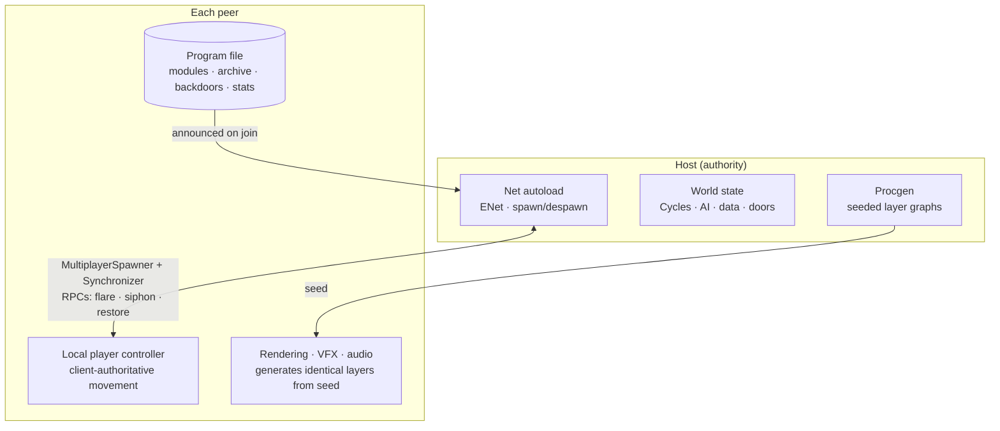

```text
src/
  core/       autoloads — Net, GameState, Modules, Rng, Debug, SteamHub, Achievements
  player/     first-person controller, beam, interaction
  world/      layer procgen, room kit, props, siphons, backdoors, Compilers
  creatures/  antivirus AI state machines
  ui/         menus, lobby, HUD
assets/       materials, sfx, fonts
tests/        headless sim tests (procgen determinism, Cycles math, AI)
```

Design deep-dive: **[DESIGN.md](DESIGN.md)** — pillars, systems math, the
fiction-earns-the-mechanics reasoning, art direction language.

## Roadmap

- [x] **M0 — Design** · concept, systems, fiction, art direction ([DESIGN.md](DESIGN.md))
- [x] **M1 — Skeleton crew** · ENet host/join, first-person controller with real feel, decryption beam, moody greybox layer, dedicated server mode
- [x] **M2 — The dark** · procgen layers + drop shafts, layer-scaled generation, Cycles + siphon taps, HUD
- [x] **M3 — The system bites** · Scrubbers + Sentinels, combat, corrupted/restore, data shards, backdoor nodes, exfiltration — *a full intrusion, playable*
- [x] **M3.5 — Steamworks** · GodotSteam GDExtension, SteamMultiplayerPeer beside ENet, friends-only lobbies + overlay invites + join-in-progress, rich presence, local-first achievements (dev app 480)
- [x] **M3.7 — Embodiment & Overhaul** · authored Scrubber + Sentinel, beveled modular architecture kit on a 4 m lattice, four-layer light rig with gobo projectors, SSR/SSIL WorldEnvironment, post v2, the Surge breaker in your hands, crew avatars, and MOTHER's signage on the walls
- [x] **M4 — The long game** · Compiler terminals in the world + a diegetic purchase panel, eight permanent module tracks resolved per player and applied host-side, the per-player program file (versioned, atomic writes, migrated from M3), the backdoor injection gate, the archive economy with depth-scaled data value, and the threat/power curve tuned across layers 1–18
- [x] **M4.8 — Functional clutter** · the density pass (cable looms, pipe runs, rubble, spills and scorch, crate stacks, dead maintenance drones — all MultiMesh-batched) plus five props that *do* things: rewire junctions, weldable vent covers that shut down a nest's reinforcement trickle, lootable cabinets with two ways in, kickable physics debris the antivirus hears, sealable bulkheads that re-route its pathing, and typed command terminals. One shared noise API underneath all of it
- [x] **M4.95 — The Expensive Pass** · the filmic graphics tier, integrated: baked-PBR tiling surfaces with a close-up detail octave, AgX tonemap, per-room reflection probes, depth-band 3D-LUT grade (surface cold → mid teal-drain → deep warm-wrong) and a cinematic post pass, kit trim/corner modules killing the wall-floor seam, and **god-ray hero shafts** — a real ceiling aperture, slatted, dropping one authored volumetric shaft into every two-storey vault, drop shaft and backdoor. The density pass gets the motivation law in geometry: cables hang on **true catenaries**, routed *from* a source *to* a load, with real fixings and coiled floor ends, and they only move where something makes them — a fine tremor on a running machine, a slow sway in a shaft's draught, dead-still everywhere else. Two shipping renderer bugs fixed on the way (the kit's dead vertex-colour wear masks; sRGB decode on custom-shader samplers). Held 60 fps with a comfortable margin across an 18-layer soak and a two-instance run; darkness law measured, not asserted
- [~] **M5 — Expensive** · *in progress.* **The Sound** has landed: the full synthesized audio palette wired to every trigger (121 SFX + 15 adaptive music stems, pure-synthesis, zero licensing), a runtime bus mixer (Master → Music·World·Creatures·Player·UI with the sub-buses), an **adaptive score** that stacks stress stems over a depth-band floor (driven now by a proxy, `MusicDirector.set_stress()` ready for M6's Director), **directional sound captions** as the deaf/HoH threat telegraph (the Scrubber-lunge caption fires with its 180 ms telegraph), an audio-comfort settings surface (per-family volumes, kill-the-CRT-whine, soften-audio-spikes), and **Linux + Windows release exports** with the GodotSteam libraries bundled per platform. Determinism held byte-identical (audio is local/cosmetic — never touches the RNG stream or the wire). Still to come this milestone: the glitch post stack, kill cams, low-Cycles presentation and menu polish
- [x] **M6 — The Haunting** · MOTHER becomes the horror director. A host-authoritative **HauntDirector** tracks crew stress and paces the hunt — spike, dread, and mercy that withholds when the crew is broken — seizing `Music.set_stress()` from the M5 proxy and speaking her authored corpus (183 barks, depth-scaled corruption, callsign address lines through a red glyph panel, budget-enforced). Three killable, solo-survivable **hunters**, each hunting by a different sense: the **Hound** (hears — noise debt spawns it; flees wounded to recompile; its howl restarts the timer), the **Moth** (sees light — the Scrubber inverted, drawn to your beam and muzzle flash), and the **Auditor** (deep rings — a fixed seeded room-sweep; deleting it ends the ring's audit). All three ride the M3 antivirus replication (existence directed like the trickle, pose/state streamed, death-as-state; mid-run joiners reconcile them, descent despawns them). The **glitch-HUD proximity sense** turns your screen breaking into the radar (routed through the A11y flash caps), and a single **Dampened Protocol** toggle softens presentation on both senses — never difficulty. Backdoor sanctuaries stay absolutely hunter-free. Determinism held byte-identical (hunter placement + the Auditor route are seeded and in the dump; spawns are host-authoritative runtime); 60 fps held on the deep two-hunter + Sentinel case

## Screenshots

> Live captures from the build — real lighting, no post-production. The world is
> the M4.95 filmic pass on top of the M3.7 kit: baked-PBR surfaces that hold up at
> 30 cm, an AgX + depth-band-LUT grade that cools with depth, per-room reflection
> probes turning every wet floor into free light, trim killing the wall-floor seam,
> and god-ray hero shafts dropped through real ceiling apertures. Dressed with the
> motivation-law density pass — machinery islands cable-fed on true catenaries that
> only move where something moves them — and M4.8's props that do something.
>
> The interface is the M3.8 pass: the shell compiles itself in when you are
> injected, hangs a few pixels behind your lens, flinches and corrupts your own
> callsign when you are hit, and starts shedding pixels as the shared pool runs
> down. Interaction prompts live **on the machine**, not across the middle of
> your screen.

*The Sentinel, alerted — the whole vault goes hostile with it, and that core on its chest is the only thing on it worth shooting:*

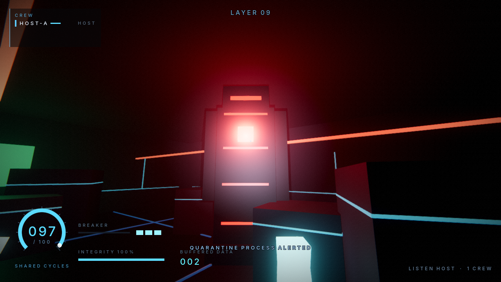

*A Scrubber in its nest, caught in a beam — the only warning you get is its sensor:*

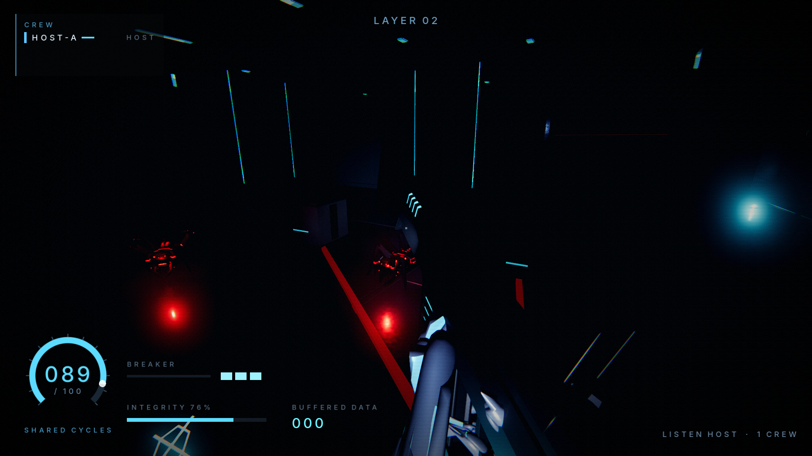

*The **Hound** (M6) — it hears you, and it does not tire. Noise debt spawns it; its howl is the timer restarting:*

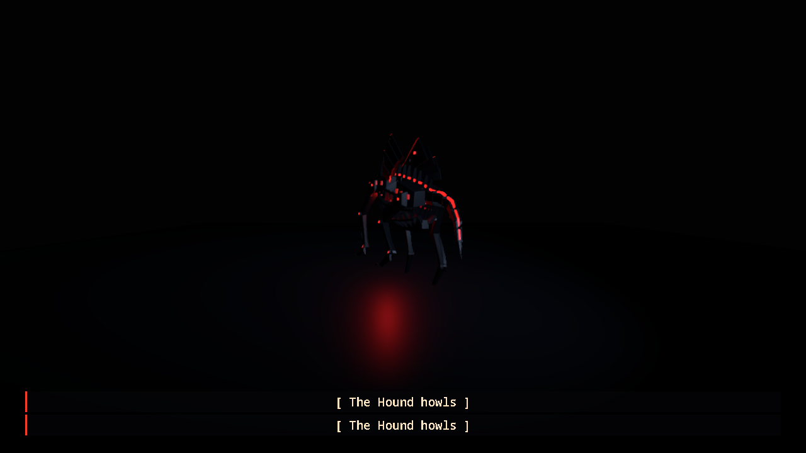

*The **Moth** (M6) — the Scrubber inverted. It comes to your light. Its iris dilates when it has you:*

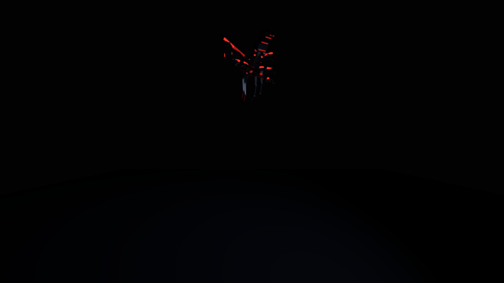

*The **Auditor** (M6, deep rings) — it does not react. It has the schedule, and it is checking the rooms in order:*

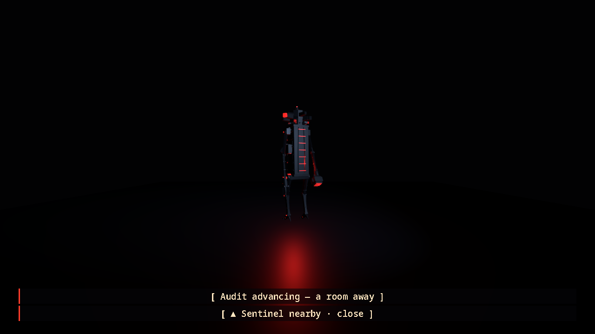

*Layer architecture: chamfered panel modules under a grazing wall wash, hanging duct runs, a hero doorframe at the end of the dark, and the floor mirroring all of it. Your instrument is amber phosphor; MOTHER's world is not:*

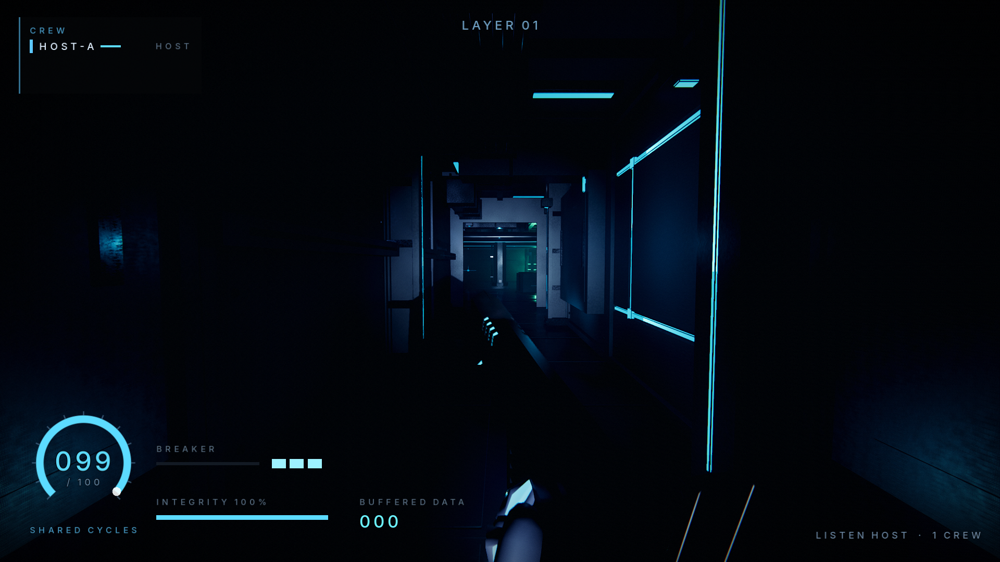

*MOTHER talks to her own processes — printed signage, read by your beam rather than lit from within. Deeper layers have been losing glyphs for a long time, and by layer 18 the architecture itself is coming apart with them:*

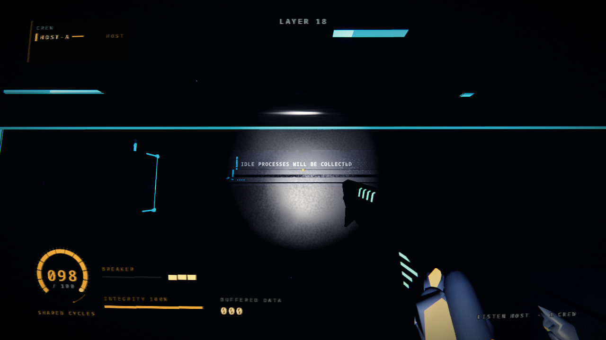

*A crewmate over your body, mid-restore — bright shell, blue seams, the same silhouette as the thing that put you down:*

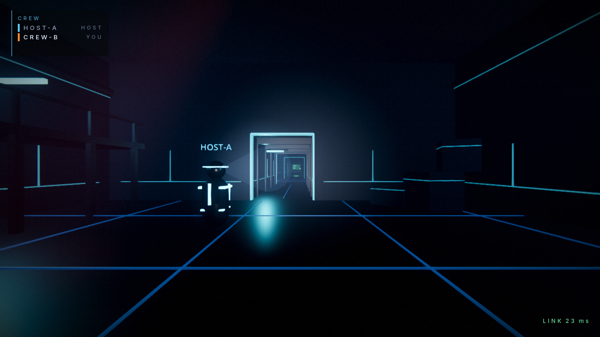

*A siphon tap in a procedurally generated layer — the prompt is a keycap tagged onto the machine itself, and its ring fills as you channel. Refill the crew's shared pool, and tell the whole layer where you are:*

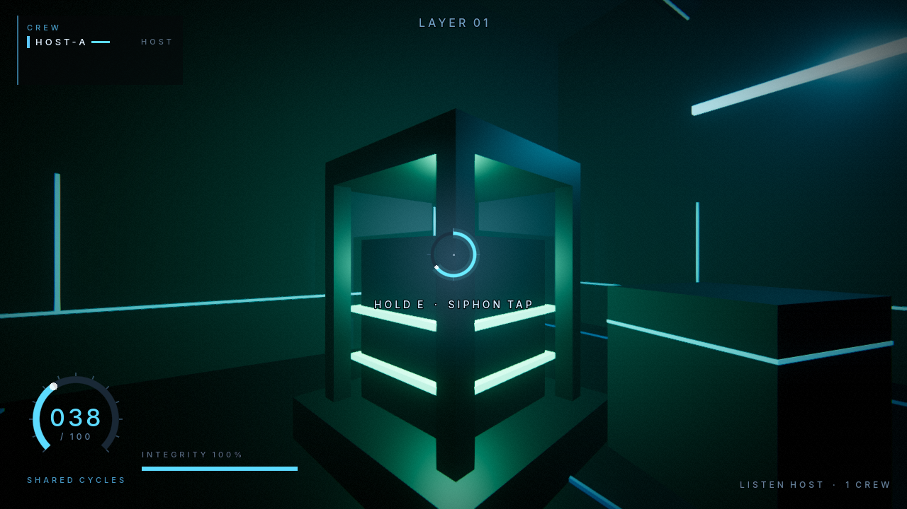

*The backdoor node: warm, symmetrical, colonnaded, and the only room on the layer antivirus will not enter:*

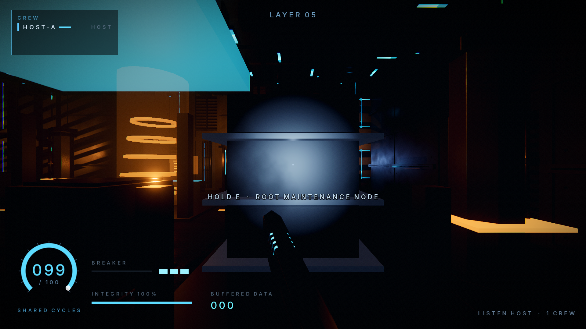

*Cycles depleted — the world starts decompiling you:*

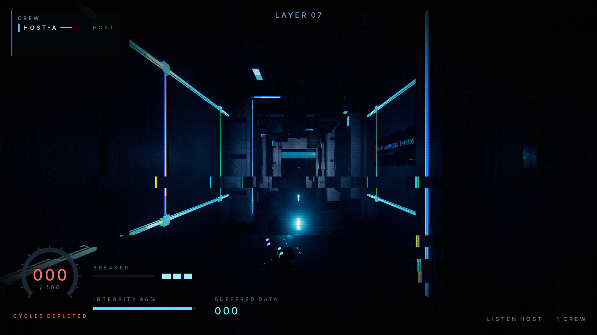

*The data vault, under its god-ray: a real ceiling aperture drops one cold volumetric shaft through the haze, dust riding it, while the walls four metres off stay black — the shaft lights the air and the floor pool, never the room. A crewmate crossing it reads as a silhouette against the light:*

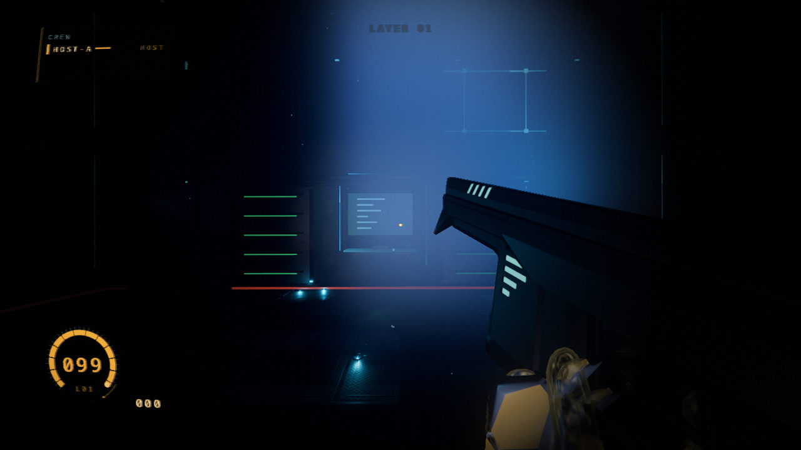

*The injection console — a Northcairn-era CRT terminal, curved glass and all, with the layer stack plotted behind it and MOTHER's chatter along the bottom rule. The shell marker you pick is the phosphor your whole interface is coated in. Committing to a dive decompiles the screen:*

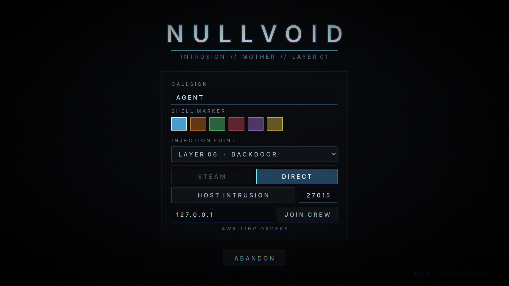

---

<div align="center">

*Designed by [@nerdrx](https://github.com/nerdrx) · planned by Claude Fable · built by Claude Opus*

`MOTHER is listening.`

</div>
